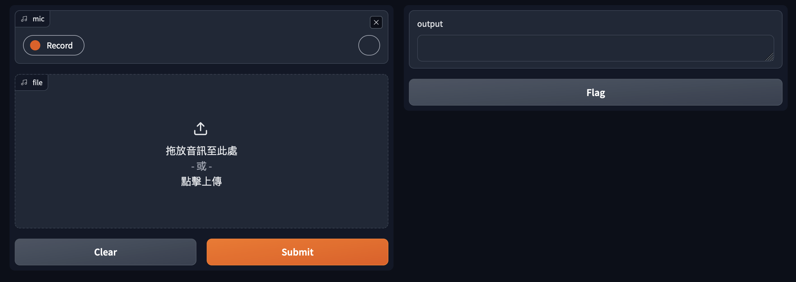
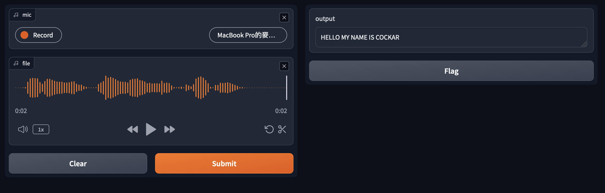

# Multi-ASR Toolkit

Multi-ASR Toolkit is a flexible and extensible speech recognition toolkit supporting multiple backend engines such as Whisper, Faster-Whisper, WhisperX, SpeechRecognition, and Vosk. It provides both a command-line interface and a web-based interface via Gradio, facilitating easy transcription of audio files using various ASR models.



## Requirements

- Python 3.10 or higher
- Gradio requires Python 3.10 or higher.
- pygame
- pydub
- [ffmpeg](https://ffmpeg.org/): for convert mp3 to wav
- [PyTorch](https://pytorch.org/get-started/locally/) 2.1+, [TensorFlow](https://www.tensorflow.org/install/pip?hl=zh-tw) 2.6+
- [transformers](https://github.com/huggingface/transformers?tab=readme-ov-file)
- [SpeechRecognition](https://github.com/Uberi/speech_recognition)

## Install

1. Python packages

    ```bash
    $ pip3 install -r requirements.txt
    ```

2. ffmpeg

    ```bash
    # Ubuntu
    $ sudo apt install ffmpeg

    # Mac
    $ brew install ffmpeg
    ```

    For `Windows`, you can refer to this website: [ffmpeg install](https://github.com/adaptlearning/adapt_authoring/wiki/Installing-FFmpeg)

## Usage

### Using through command line interface (CLI)

```bash
$ python app.py --mode cli <wav/mp3 file>     
```

### Using through web application (made with `Gradio`)

```bash
$ python3 app.py
```


